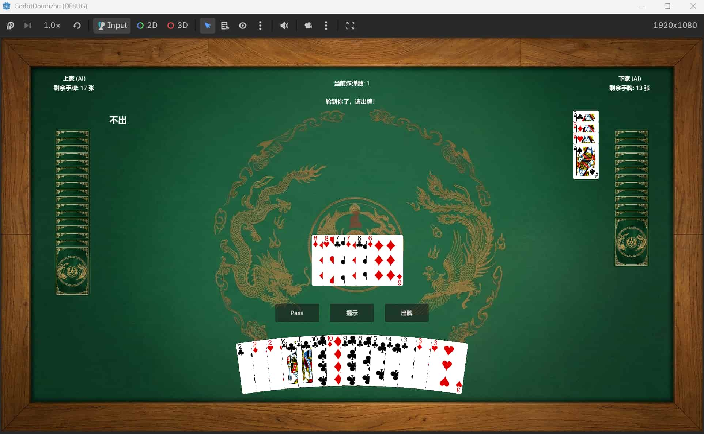

# 🃏 Godot-DouZero

   

这是一个基于 **Godot Engine (C#)** 开发的斗地主小游戏 Demo。项目在底层接入了强化学习模型 [DouZero](https://github.com/kwai/DouZero)，同时在 UI 渲染和交互逻辑上进行了一系列深度优化，力求在轻量级的框架下实现丝滑、顺畅的卡牌对战体验。

## 👀Demo截图

## ✨ 核心亮点

* **DouZero 原生驱动**：告别传统的规则树硬编码，直接接入 DouZero 强化学习模型，为 NPC 赋予真实的博弈策略与对战压迫感。

* **无分配 UI (Zero-Allocation)**：出牌阶段彻底规避了高耗能的 `QueueFree()` 与实例化流程。卡牌实体在玩家手牌与出牌区之间直接进行节点转移（Reparenting），大幅降低 GC 压力。
* **O(1) 暗牌更新**：AI 手牌显示采用精准的“尾部差值消除法”，只有在卡牌数量实际变化时才做局部增删，避免了整个列表无意义的重绘闪烁。

* **纯数学驱动排版**：放弃自带的横向容器，底层手写三角函数计算卡牌法线向量，实现优美的拱形（Arch）扇形展开。
* **Tween 物理阻尼**：卡牌的悬浮弹出、打出与手牌收缩重排，全部由 Godot 原生 Tween 接管。加入动画打断保护（Kill）与缓出曲线（Ease-Out），手感干脆且 Q 弹。

## 🛠️ 技术栈
* **游戏引擎**：Godot (C# 版本)
* **核心语言**：C# 
* **AI 算法**：DouZero (强化学习)